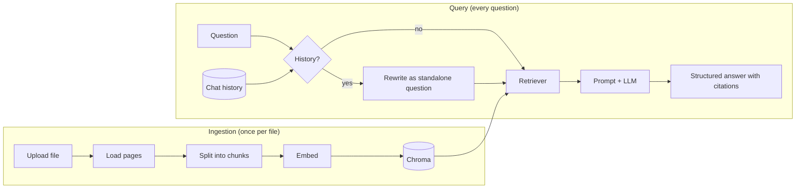

# Lantern

Ask questions about your documents and get answers with page-level citations.

Lantern is a retrieval-augmented generation (RAG) service built with LangChain and FastAPI. Upload PDFs, Markdown or text files, ask questions in plain language, and get structured answers grounded in your documents, each tied back to the file and page it came from. It handles follow-up questions, declines questions the documents can't answer, and is measured against an evaluation suite.

## Features

- **Grounded answers with citations.** Every answer cites its sources inline (`[1]`, `[2]`), and the API returns the filename, page and a snippet for each one.
- **Says "not found" instead of guessing.** Questions the documents don't cover are declined rather than answered from the model's general knowledge.
- **Follow-up questions.** Per-session chat history, plus a query-rewrite step that turns "what about chapter 3?" into a standalone search query.
- **Structured, validated output.** Answers are Pydantic models produced with the model provider's native structured outputs, so required fields are always present.
- **Evaluation suite.** 28 test cases scoring retrieval, answer correctness (LLM-as-judge), refusals and citation precision.
- **Fully tested without API keys.** 61 tests run against fake models and an in-memory vector store.

## How it works



1. **Ingestion:** each upload is loaded one page at a time, split into overlapping chunks of about 1,000 characters, embedded, and stored in Chroma with its filename and page number.
2. **Rewrite:** if the conversation has history, the model rewrites the follow-up into a standalone question. The first question in a session skips this step.
3. **Retrieval:** the question is embedded and the 4 nearest chunks are retrieved.
4. **Answer:** the chunks are numbered in the prompt, and the model returns a `GroundedAnswer` with `answer`, `citations`, `answerable` and `confidence`. The API maps each citation number back to its chunk.

The whole pipeline is a single LCEL chain in [`lantern/chains.py`](lantern/chains.py).

## Evaluation

The eval suite runs the real pipeline against a fictional corpus (so answers can't come from the model's prior knowledge) and scores retrieval and answers separately, so a failure points to either retrieval or the prompt.

| Metric                                    | Result     |
| ----------------------------------------- | ---------- |
| Answer accuracy (28 cases)                | 100%       |
| Correctly declined unanswerable questions | 100% (5/5) |
| False refusals                            | 0%         |
| Retrieval hit rate                        | 100%       |
| Citation precision                        | 92%        |
| Mean latency                              | 1.7 s      |

Configuration: Claude Haiku 5.5, `all-MiniLM-L6-v2` embeddings, k = 4, chunk size 1,000, overlap 150.

The first run scored 86%. Inspecting the failures showed two problems: the model occasionally omitted required fields when using tool-calling for structured output (fixed by switching to strict `json_schema` structured outputs), and one reference answer in the dataset was itself wrong. The corpus is small, so these results serve as a regression baseline; see the roadmap for harder evaluations.

```bash
python -m evals.run_evals                       # run with settings from .env
python -m evals.run_evals --k 2 --chunk-size 400  # try different settings
python -m evals.run_evals --only ab-e07          # run specific cases
python -m evals.run_evals --fail-under 0.9       # exit 1 below 90% (for CI)
```

Each run prints failed cases with the expected answer, the actual answer and the judge's reasoning, and saves a full report to `evals/results/`.

## Getting started

Requires Python 3.12 and an [Anthropic API key](https://platform.claude.com/).

```bash
git clone <repo-url> lantern && cd lantern
python -m venv .venv && source .venv/bin/activate
pip install -r requirements.txt
```

Create a `.env` file:

```
ANTHROPIC_API_KEY=sk-ant-...
```

Run the tests, then start the server:

```bash
pytest
uvicorn app.main:app --reload
```

Open http://localhost:8000/docs for interactive API docs. The embedding model (about 90 MB) downloads on first use.

### Docker

```bash
docker build -t lantern .
docker run -p 8000:8000 --env-file .env -v lantern-data:/data lantern
```

The volume keeps the vector store and uploads across restarts.

## API

| Method   | Path              | Description                                                  |
| -------- | ----------------- | ------------------------------------------------------------ |
| `POST`   | `/documents`      | Upload and ingest a `.pdf`, `.md` or `.txt` file             |
| `GET`    | `/documents`      | List ingested documents and chunk counts                     |
| `DELETE` | `/documents/{id}` | Remove a document and its chunks                             |
| `POST`   | `/ask`            | Ask a question; pass `session_id` to continue a conversation |
| `DELETE` | `/sessions/{id}`  | Clear a conversation's history                               |
| `GET`    | `/health`         | Health check                                                 |

Example:

```bash
curl -X POST localhost:8000/documents -F "file=@handbook.pdf"

curl -X POST localhost:8000/ask -H "Content-Type: application/json" \
  -d '{"question": "When are rides cancelled because of weather?"}'
```

```json
{
  "answer": "Rides are cancelled if it's below -5°C at the start time or if lightning is forecast [1].",
  "answerable": true,
  "confidence": "high",
  "sources": [
    {
      "index": 1,
      "document_id": "3f9c...",
      "document": "handbook.pdf",
      "page": 3,
      "snippet": "Weather. Rides are cancelled if the temperature is below -5 degrees Celsius..."
    }
  ],
  "session_id": "a81e...",
  "standalone_question": "When are rides cancelled because of weather?"
}
```

Send the returned `session_id` with the next question to ask a follow-up.

## Configuration

Set in `.env` or as environment variables.

| Variable                       | Default                                              | Description                                     |
| ------------------------------ | ---------------------------------------------------- | ----------------------------------------------- |
| `ANTHROPIC_API_KEY`            | (required)                                           | API key for the default model                   |
| `LLM_MODEL`                    | `anthropic:claude-haiku-5-5`                         | Chat model, as `provider:model`                 |
| `EMBEDDING_MODEL`              | `huggingface:sentence-transformers/all-MiniLM-L6-v2` | Embedding model; runs locally by default        |
| `RETRIEVAL_K`                  | `4`                                                  | Chunks retrieved per question                   |
| `CHUNK_SIZE` / `CHUNK_OVERLAP` | `1000` / `150`                                       | Chunking, in characters                         |
| `HISTORY_MAX_MESSAGES`         | `10`                                                 | History sent per turn (2 messages per exchange) |
| `CHROMA_PERSIST_DIR`           | `data/chroma`                                        | Vector store location                           |
| `UPLOAD_DIR`                   | `data/uploads`                                       | Uploaded file location                          |

Changing `EMBEDDING_MODEL` requires deleting `data/chroma` and re-uploading documents, since vectors from different models aren't comparable.

## Project structure

```
lantern/
├── app/                 # FastAPI layer
│   ├── main.py          # routes
│   ├── schemas.py       # request/response models
│   └── config.py        # settings and shared dependencies
├── lantern/             # LangChain logic, independent of the API
│   ├── ingest.py        # load, split, embed, store
│   ├── retrieval.py     # retriever and context formatting
│   ├── chains.py        # LCEL chains: rewrite, retrieve, answer
│   ├── answer.py        # GroundedAnswer output schema
│   └── memory.py        # per-session chat history
├── evals/               # evaluation suite
│   ├── corpus/          # fictional test documents
│   ├── dataset.jsonl    # questions, reference answers, expected sources
│   ├── metrics.py       # scoring
│   ├── judge.py         # LLM-as-judge
│   └── run_evals.py     # CLI runner
├── tests/               # 61 tests, no API keys needed
└── Dockerfile
```

## Design decisions

- **Models are injected, not created inside chains.** Chains take the model as an argument, and FastAPI provides it through dependency injection. Tests swap in fake models, and changing providers is a config change.
- **Retrieval and answering are scored separately.** When an answer is wrong, the eval report shows whether the right chunk was retrieved, which says whether to fix retrieval or the prompt.
- **Strict structured outputs over tool calling.** The eval suite showed tool-calling-based output occasionally dropping required fields. Native `json_schema` structured outputs constrain the model to the schema.
- **Citations are validated.** Citation numbers that don't match a retrieved chunk are discarded rather than passed to the client.
- **Local embeddings by default.** `all-MiniLM-L6-v2` runs on CPU with no API key or cost, keeping only the chat model as a paid dependency.

## Roadmap

- [x] Basic LCEL chain and FastAPI service
- [x] RAG pipeline with page-level citations
- [x] Structured output
- [x] Conversation memory with query rewriting
- [x] Evaluation suite
- [ ] Harder evals on a large real-world document
- [ ] LangGraph agent that decides when to retrieve and can use other tools
- [ ] LangSmith tracing
- [ ] Persistent chat history (Redis)
- [ ] Deployed demo

## Tech stack

Python 3.12 · FastAPI · LangChain · Chroma · sentence-transformers · Claude · Pydantic · pytest · Docker
